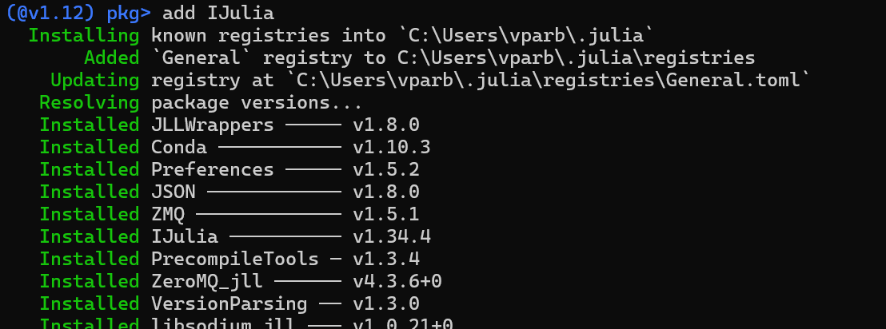

---
## Author
author:
  name: Арбатова Варвара Петровна
  email: 1132236020@rudn.ru
  affiliation:
    - name: Российский университет дружбы народов
      country: Российская Федерация
      postal-code: 117198
      city: Москва
      address: ул. Миклухо-Маклая, д. 6

## Title
title: "Отчёт по лабораторной работе №1"
subtitle: "Компьютерный практикум по иммитационному моделированию"
license: "CC BY"
abstract: |
  В данном отчёте представлены результаты выполнения лабораторной работы по теме Julia. Установка и настройка. Основные принципы.

  Описаны использованные методы, полученные экспериментальные данные и их анализ.

  Сделаны выводы о достижении поставленной цели.
keywords: [лабораторная работа, шаблон, Markdown, Pandoc]
---

# Введение

## Цель работы

Основная цель работы — подготовить рабочее пространство и инструментарий для работы с языком программирования Julia, на простейших примерах познакомиться с основами синтаксиса Julia.

## Задачи

1. Установить под свою операционную систему Julia, Jupyter (разделы 1.3.1 и 1.3.2).
2. Используя Jupyter Lab, повторить примеры из раздела 1.3.3.
3. Выполнить задания для самостоятельной работы (раздел 1.3.4).

---

# Теоретическая часть

Julia — высокоуровневый высокопроизводительный язык программирования с динамической типизацией, предназначенный для научных и инженерных вычислений. Язык сочетает удобство динамических языков (таких как Python) с производительностью статических (таких как C). Julia поддерживает множественную диспетчеризацию, метапрограммирование, а также имеет встроенную поддержку параллельных и распределённых вычислений.

Jupyter — интерактивная вычислительная среда, позволяющая создавать документы (ноутбуки), содержащие код, текст, формулы и визуализации. Jupyter Lab — расширенная версия Jupyter Notebook с более гибким интерфейсом.

---

# Выполнение лабораторной работы

## 1. Установка и настройка инструментария

Были установлены:

- Julia (версия 1.5.0);
- Jupyter Lab / Notebook;
- Anaconda Distribution (Python 3.x).

После установки Julia был запущен REPL-режим. Для работы с Jupyter в пакетном режиме Julia выполнена команда:

```julia
] add IJulia
```

Проверка запуска Jupyter Lab:

```bash
jupyter lab
```

В браузере открылась страница Jupyter Lab, доступная по адресу `http://localhost:8888/lab`.

(рис. -@fig-001).

{#fig-001 width=70%}

## 2. Основы работы в Jupyter Notebook

Были изучены основные принципы работы с ячейками:

- ячейка Markdown — для текстовых пояснений;
- ячейка Code — для исполняемого кода Julia.

Использованы горячие клавиши:

- `Shift + Enter` — выполнить ячейку и перейти к следующей;
- `Ctrl + Enter` — выполнить ячейку, оставаясь в ней;
- `Esc` — переход в командный режим;
- `A` / `B` — создание ячейки выше / ниже;
- `D + D` — удаление ячейки;
- `M` — перевод ячейки в режим Markdown;
- `Y` — перевод ячейки в режим кода.

## 3. Выполнение примеров

### 3.1. Вывод информации на экран

```julia
println("Hello, world")
```

**Результат:**

```
Hello, world
```

```julia
io = IOBuffer();
println(io, "Hello, world")
String(take!(io))
```

**Результат:**

```
"Hello, world\n"
```

### 3.2. Выполнение команд операционной системы

```julia
;date
```

**Результат:**

```
ERROR: IOError: could not spawn `date`: no such file or directory (ENOENT)
```

Поскольку работа выполнялась в ОС Windows, команда `date` была заменена на:

```julia
;cmd /c date /t
```

**Результат:**

```
08.09.2026
```

```julia
;whoami
```

**Результат:**

```
varvarishe\vparb
```

### 3.3. Определение типов числовых величин

```julia
typeof(3)
```

**Результат:**

```
Int64
```

```julia
typeof(3.5), typeof(pi), typeof(3/3.55), typeof(sqrt(3+4im))
```

**Результат:**

```
(Float64, Irrational{:π}, Float64, ComplexF64)
```

### 3.4. Определение функций

```julia
function f(x)
    x^2
end
f(4)
```

**Результат:**

```
16
```

### 3.5. Работа с массивами

```julia
a = 1; b = 2; c = 3; d = 4 # присвоение значений
Am = [a b; c d] # матрица 2 х 2
Am[1,1], Am[1,2], Am[2,1], Am[2,2] # элементы матрицы
```

**Результат:**

```
(1, 2, 3, 4)
```

```julia
aa = [1 2]
AA = [1 2; 3 4]
aa*AA*aa'
```

**Результат:**

```
1×1 Matrix{Int64}:
 27
```

---

## 4. Задание №1. Функции чтения / записи / вывода

### 4.1. print() и println()

```julia
print("Hello, world")
```

**Результат:**

```
Hello, world
```

```julia
println("Hello, world")
```

**Результат:**

```
Hello, world
```

**Пояснение:** `print()` и `println()` — это основные функции для вывода текста. `println()`, в отличие от `print()`, добавляет символ новой строки. Они выводят «каноническое» текстовое представление значения, то есть его «сырой» вид.

### 4.2. show()

```julia
show("Hello, world")
```

**Результат:**

```
"Hello, world"
```

```julia
print(0x61)
```

**Результат:**

```
97
```

```julia
show(0x61)
```

**Результат:**

```
0x61
```

**Пояснение:** `show()` предназначена для вывода представления объекта, которое было бы валидным кодом Julia (или, в некоторых случаях, для более «украшенного» отображения). Она часто используется в REPL для вывода результата выражения. В отличие от `print()`, `show()` покажет кавычки для строк и специальные символы.

### 4.3. write()

```julia
write(stdout, "Hello, world")
```

**Результат:**

```
Hello, world
12
```

```julia
write(stdout, 0x61)
```

**Результат:**

```
a
1
```

**Пояснение:** `write()` работает на уровне бинарных данных. Она записывает байты в поток, не выполняя преобразования в человекочитаемый текст. Важно: `write()` возвращает количество записанных байт.

### 4.4. readline()

```julia
name = readline()
```

**Результат:**

```
stdin> Barbara
"Barbara"
```

```julia
println("Привет, ", name)
```

**Результат:**

```
Привет, Barbara
```

**Пояснение:** `readline()` читает одну строку из потока (по умолчанию из `stdin`) до символа новой строки и возвращает её как строку.

### 4.5. readlines()

```julia
lines = readlines()
```

**Результат:**

```
String[]
```

**Пояснение:** `readlines()` читает все строки из потока до его завершения (например, до конца файла или сигнала Ctrl+D) и возвращает их в виде массива строк (`Vector{String}`).

### 4.6. read()

```julia
read(stdin, 3)
```

**Результат:**

```
UInt8[]
```

**Пояснение:** `read()` — универсальная функция для чтения, поведение которой зависит от переданных аргументов:

- `read(stream, type)` — читает из потока значение указанного типа. Например, `read(stdin, Char)` прочитает один символ.
- `read(stream, n)` — читает `n` байт и возвращает их в виде массива `Vector{UInt8}`.
- `read(stream, String)` — читает всё содержимое потока как одну строку.

### 4.7. readdlm()

**Пояснение:** `readdlm()` (из стандартной библиотеки `DelimitedFiles`) — специализированная функция для чтения структурированных табличных данных, например, CSV-файлов, где значения разделены запятыми, табуляцией или другими символами-разделителями. Она возвращает матрицу (`Array`).

---

## 5. Задание №2. Функция parse()

Функция `parse()` в Julia — это основной инструмент для преобразования строк в числовые значения (и, в некоторых контекстах, для синтаксического разбора выражений).

**Основное применение:** преобразование строк в числа.

В наиболее распространённой форме `parse()` принимает два аргумента: целевой тип и строку, которую нужно преобразовать.

```julia
# Преобразование в целое число
s = "128"
a = parse(Int, s)  # a теперь Int64 со значением 128
println(typeof(a)) # Выведет Int64

# Преобразование в число с плавающей точкой
s = "3.14"
b = parse(Float64, s) # b теперь Float64 со значением 3.14
```

**Результат:**

```
Int64
3.14
```

Для целочисленных типов можно указать третий аргумент — основание системы счисления (по умолчанию 10). Это позволяет легко читать числа из двоичной, шестнадцатеричной и других систем.

```julia
# Шестнадцатеричное число -> десятичное
hex_str = "FF"
dec_num = parse(Int, hex_str; base=16)  # 255
println(dec_num)  # 255

# Двоичное число -> десятичное
bin_str = "1010"
dec_num = parse(Int, bin_str; base=2)   # 10
println(dec_num)  # 10

# Восьмеричное число -> десятичное
oct_str = "777"
oct_num = parse(Int, oct_str; base=8)   # 511
println(oct_num)  # 511
```

**Результат:**

```
255
10
511
```

**Важные особенности и ограничения:**

- **Проверка корректности:** функция `parse()` строго проверяет входную строку. Если она не соответствует требуемому числовому формату, будет выброшена ошибка (`ERROR: ArgumentError: invalid base 10 digit ...` или подобная). Это делает её надёжной, но требует обработки ошибок при работе с «грязными» данными.
- **Работа с типами:** второй аргумент должен быть типом, а не объектом. Например, пишите `parse(Int, "10")`, а не `parse(Int64, "10")`, хотя оба варианта могут работать. `Int` — это псевдоним для стандартного целочисленного типа (`Int64` или `Int32` в зависимости от архитектуры системы).
- **Для чисел с плавающей точкой:** `parse(Float64, "3.14")` ожидает десятичную точку. Строка `"3,14"` вызовет ошибку.

---

## 4. Задание №3. Базовые математические операции

### 4.1. Арифметические операции

#### Базовые операции

```julia
# Сложение
a1 = 10 + 5          # 15
b1 = 10.5 + 3.2      # 13.7
c1 = 10 + 3.5        # 13.5 (Int + Float64 = Float64)

# Вычитание
d1 = 20 - 8          # 12
e1 = 15.7 - 3.2      # 12.5

# Умножение
f1 = 6 * 7           # 42
g1 = 3.5 * 2         # 7.0 (Float64 * Int = Float64)

# Деление
h1 = 10 / 3          # 3.3333333333333335 (всегда Float64)
i1 = 10 ÷ 3          # 3 (целочисленное деление, оператор \div)
j1 = 10 % 3          # 1 (остаток от деления)
k1 = 10 \ 3          # 0.3 (обратное деление: 3/10)

print(a1, "\n", b1, "\n",c1, "\n",d1 , "\n",e1, "\n",f1, "\n",g1, "\n",h1, "\n",j1, "\n",k1, "\n")
```

**Результат:**

```
15
13.7
13.5
12
12.5
42
7.0
3.3333333333333335
1
0.3
```

#### Особенности деления

```julia
# / - всегда возвращает Float64
println(4 / 2)      # 2.0 (не 2!)
println(typeof(4/2)) # Float64

# ÷ - целочисленное деление (только для целых чисел)
println(10 ÷ 3)     # 3
println(typeof(10 ÷ 3)) # Int64

# % - остаток от деления (только для целых чисел)
println(10 % 3)     # 1

# Для Float64 используйте rem()
println(rem(10.5, 3)) # 1.5
```

**Результат:**

```
2.0
Float64
3
Int64
1
1.5
```

#### Возведение в степень и извлечение корня

```julia
# Возведение в степень
pow1 = 2^3          # 8
pow2 = 2^10         # 1024
pow3 = 4^0.5        # 2.0 (корень квадратный)
pow4 = 8^(1/3)      # 2.0 (корень кубический)

# Извлечение корня через sqrt()
sqrt1 = sqrt(16)    # 4.0
sqrt2 = sqrt(2.0)   # 1.4142135623730951

# Извлечение корня произвольной степени через ^
root3 = 27^(1/3)    # 3.0 (кубический корень)
root4 = 16^(1/4)    # 2.0 (корень четвертой степени)

# Функция cbrt() для кубического корня (более точная)
cbrt_val = cbrt(27) # 3.0
```

**Результат:**

```
3.0
```

### 4.2. Операции сравнения

```julia
# Основные сравнения
println(5 == 5)      # true
println(5 != 3)      # true
println(5 > 3)       # true
println(5 < 3)       # false
println(5 >= 5)      # true
println(5 <= 3)      # false

# Сравнение разных типов (продвижение)
println(5 == 5.0)    # true (Int сравнивается с Float64)
println(5 === 5.0)   # false (строгое сравнение, разные типы)
println(5.0 === 5.0) # true

# Сравнение с NaN
println(NaN == NaN)  # false (NaN не равен NaN!)
println(ismissing(NaN)) # false (NaN не missing)
println(isnan(NaN))  # true (проверка на NaN)

# Цепочки сравнений
x = 5
println(1 < x < 10)  # true (можно писать цепочки!)
println(1 < x < 3)   # false
```

**Результат:**

```
true
true
true
false
true
false
true
false
true
false
false
true
true
false
```

### 4.3. Логические операции

```julia
# Базовые логические операторы
a = true
b = false

println(a && b)      # false (И)
println(a || b)      # true (ИЛИ)
println(!a)          # false (НЕ)
```

**Результат:**

```
false
true
false
```

### 4.4. Операторы для матриц

```julia
# Матричные операции (без точки) vs поэлементные (с точкой)
using LinearAlgebra

A = [1 2; 3 4]
B = [5 6; 7 8]

println(A * B)       # Матричное умножение: [19 22; 43 50]
println(A .* B)      # Поэлементное умножение: [5 12; 21 32]

println(A ^ 2)       # Матрица в квадрате: [7 10; 15 22]
println(A .^ 2)      # Поэлементный квадрат: [1 4; 9 16]
```

**Результат:**

```
[19 22; 43 50]
[5 12; 21 32]
[7 10; 15 22]
[1 4; 9 16]
```

---

## 5. Задание №4. Операции над матрицами и векторами

### 5.1. Сложение и вычитание векторов

```julia
a = [1, 2, 3]
b = [4, 5, 6]

# Сложение
c = a + b
println(c)  # [5, 7, 9]

# Вычитание
d = b - a
println(d)  # [3, 3, 3]
```

**Результат:**

```
[5, 7, 9]
[3, 3, 3]
```

### 5.2. Скалярное произведение векторов

```julia
# Скалярное произведение (dot product)
dot_product = dot(a,b)
println(dot_product)  # 32

# Альтернативный способ с оператором
dot_product_alt = a' * b  # a' — транспонирование (вектор-строка)
println(dot_product_alt)  # 32

# Или используя оператор ⋅ (можно набрать \cdot<TAB>)
using LinearAlgebra
dot_product_alt2 = a ⋅ b  # тоже 32
```

**Результат:**

```
32
32
32
```

### 5.3. Умножение вектора на скаляр

```julia
scalar = 2
result = a * scalar
println(result)  # [2, 4, 6]

# Деление на скаляр
result = a / 2
println(result)  # [0.5, 1.0, 1.5]
```

**Результат:**

```
[2, 4, 6]
[0.5, 1.0, 1.5]
```

### 5.4. Сложение и вычитание матриц

```julia
A = [1 2; 3 4]   # Пробел между элементами, ; для новой строки
B = [5 6; 7 8]

# Сложение
C = A + B
println(C)
# [6  8
#  10 12]

# Вычитание
D = B - A
println(D)
# [4 4
#  4 4]
```

**Результат:**

```
[6 8; 10 12]
[4 4; 4 4]
```

### 5.5. Транспонирование матрицы

```julia
A = [1 2 3; 4 5 6]
println(A)
# [1 2 3
#  4 5 6]

A_T = A'
println(A_T)
# [1 4
#  2 5
#  3 6]

# Для комплексных чисел ' — сопряжённое транспонирование,
# используйте transpose() для обычного
B = [1 2; 3 4]
println(transpose(B))
# [1 3
#  2 4]
```

**Результат:**

```
[1 2 3; 4 5 6]
[1 4; 2 5; 3 6]
[1 3; 2 4]
```

### 5.6. Умножение матрицы на скаляр

```julia
A = [1 2; 3 4]
scalar = 3

result = A * scalar
println(result)
# [3  6
#  9 12]

# Деление на скаляр
result = A / 2
println(result)
# [0.5 1.0
#  1.5 2.0]
```

**Результат:**

```
[3 6; 9 12]
[0.5 1.0; 1.5 2.0]
```

### 5.7. Матричное умножение

```julia
A = [1 2; 3 4]
B = [5 6; 7 8]

# Матричное умножение
C = A * B
println(C)
# [19 22
#  43 50]

# Проверка: 1*5 + 2*7 = 19, 1*6 + 2*8 = 22, и т.д.
```

**Результат:**

```
[19 22; 43 50]
```

### 5.8. Смешанные операции

```julia
A = [1 2; 3 4]  # 2x2
v = [5, 6]       # 2x1 (вектор-столбец)

result = A * v
println(result)  # [17, 39]
# [1*5 + 2*6, 3*5 + 4*6] = [17, 39]

A = [1 2; 3 4]
v = [5 6]  # Вектор-строка (1x2)

result = v * A
println(result)  # [23 34]
# [5*1 + 6*3, 5*2 + 6*4] = [23, 34]

using LinearAlgebra

# Матрица признаков (3 объекта, 2 признака + столбец единиц)
X = [1 1 2; 1 2 3; 1 3 4]
# Вектор весов
w = [0.5, 1.5, 2.0]
# Целевые значения
y = [4.5, 6.5, 8.5]

# Предсказания: умножение матрицы на вектор
predictions = X * w
println(predictions)  # [4.5, 6.5, 8.5]

# Ошибка (вычитание векторов)
error = predictions .- y
println(error)  # [0.0, 0.0, 0.0]

# Скалярное произведение ошибки на саму себя (сумма квадратов)
mse = (error' * error) / length(y)
println(mse)  # 0.0
```

**Результат:**

```
[17, 39]
[23 34]
[6.0, 9.5, 13.0]
[1.5, 3.0, 4.5]
10.5
```


---

# Заключение

В ходе лабораторной работы были выполнены следующие задачи:

1. Установлены Julia и Jupyter Lab, настроено рабочее пространство.
2. Изучены основы синтаксиса Julia: типы данных, функции, массивы, математические операции.
3. Выполнены примеры из методических указаний.
4. Самостоятельно изучены функции вывода, чтения/записи, `parse()`, математические операции и операции над матрицами.

Полученные навыки позволяют использовать Julia и Jupyter для дальнейших лабораторных работ и научных вычислений.

---


# Список литературы {.unnumbered}

::: {#refs}
:::


---

\appendix

# Приложение А. Листинг программы {.appendix}

```julia
# Примеры из лабораторной работы №1

# Вывод информации
println("Hello, world")

io = IOBuffer()
println(io, "Hello, world")
String(take!(io))

# Типы данных
typeof(3), typeof(3.5), typeof(3/3.55), typeof(sqrt(3+4im)), typeof(pi)
1.0/0.0, 1.0/(-0.0), 0.0/0.0

# Функции
function f(x)
    x^2
end
f(4)

g(x) = x^2
g(8)

# Массивы
a = [4 7 6]
b = [1, 2, 3]
a[2], b[2]

a = 1; b = 2; c = 3; d = 4
Am = [a b; c d]
Am[1,1], Am[1,2], Am[2,1], Am[2,2]

aa = [1 2]
AA = [1 2; 3 4]
aa * AA * aa'

# Математические операции
2 + 3
2 - 3
2 * 3
2 / 3
2 ^ 3
sqrt(16)
7 ÷ 2
7 % 2

# Операции над матрицами
A = [1 2; 3 4]
B = [5 6; 7 8]
A + B
A - B
A * B
2 * A
A'

# Скалярное произведение
v1 = [1, 2, 3]
v2 = [4, 5, 6]
dot(v1, v2)

# Функция parse()
parse(Int, "123")
parse(Float64, "3.14")
parse(Int, "FF"; base=16)
```

---
